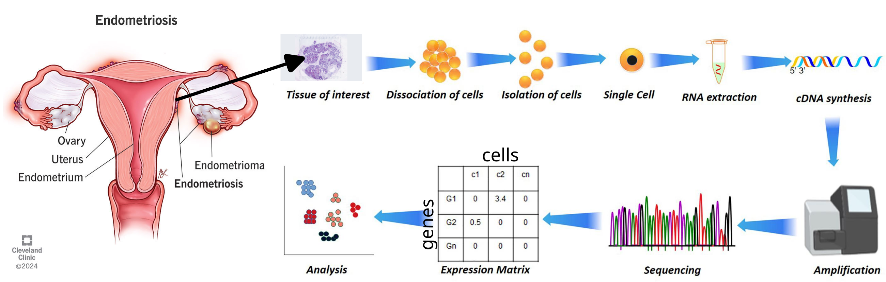

# Project Overview

<figure>
<p align="center">
  
</p>
  <figcaption align="center"><b>Figure.</b> Diagram representing endometriosis and single cell RNA sequencing concept.</figcaption>
</figure>
</br></br>


Every month during menstruation, the body naturally sheds cells from the lining of the uterus, along with blood and fluid. These shed cells contain important information about how the uterus is working and whether something might be going wrong, such as inflammation or [endometriosis](https://www.nhs.uk/conditions/endometriosis/). Endometriosis affects the way cells in the uterus grow, behave, and communicate. This means that even the cells that naturally leave the body during a period can show signs of: inflammation, stress, hormone sensitivity or immune changes.  

Modern laboratory techniques can detect these patterns without the need for surgery. Despite being an obvious and easily accessible biological sample, menstrual blood has been largely overlooked in clinical practice and research. That is now beginning to change - read more in this [Guardian](https://www.theguardian.com/society/ng-interactive/2025/oct/27/menstrual-period-blood-testing-womens-health) piece, and explore the emerging start-ups focusing on menstrual blood analysis.

Single-cell RNA sequencing (scRNA-seq) is a technique that allows scientists to examine thousands of cells individually, revealing what each one is doing. By applying this method to menstrual effluent, researchers, such as [Shih et al, BMC Med 20, 315 (2022)](https://doi.org/10.1186/s12916-022-02500-3), hope to develop future diagnostic tools that are non-invasive, faster, aligned with the natural menstrual cycle, and able to detect endometriosis earlier and more accurately.


# Tech Stack

**ML | Data Science**

🧠 Variational autoencoder • Transfer learning

🤖 numpy • pandas • scikit-learn • PyTorch

📊 seaborn • matplotlib


**Computational biology**

🧬 scanpy • scvi-tools


# Motivation


The aim of this project was to build an end-to-end service in which users could upload single-cell data from menstrual effluent and receive a patient-level risk score for endometriosis. Using single-cell RNA sequencing (scRNA-seq) data derived from menstrual effluent, I applied unsupervised learning to identify major cell populations (such as immune and stromal). I then trained a classifier to distinguish endometriosis from healthy controls. This is just a toy project, but it could represent a small step toward reducing the diagnostic delays that many patients currently experience.

 Initially, I planned to use the scRNA-seq dataset generated by [Shih et al, BMC Med 20, 315 (2022)](https://doi.org/10.1186/s12916-022-02500-3) which includes 33 menstrual blood samples from patients categorized as endometriosis, control, and asymptomatic. However, during exploratory analysis I discovered that the authors did not provide patient-level labels, making it impossible to distinguish which samples belonged to which group. Only three endometrial samples could be confidently identified.

As a result, I revised my approach. I first analysed samples scRNA-seq provided by the integrated single-cell reference atlas of the human endometrium by of control patients and the ones with endometriosis (data provided by [Marečková et al, Nat Genet 56, 1925–1937 (2024)](https://doi.org/10.1038/s41588-024-01873-w)), trained a generative model on it, and then tested it using the three menstrual blood samples from patients with endometriosis to evaluate whether they could be classified as positive. This approach may help pinpoint key cell types and molecular changes linked to endometriosis and support the development of future non-invasive diagnostic tools based on classification. 

At the moment the predictions just aren't reliable. I'll return to this once I figure out what’s missing in the data, find additional datasets that fit the project, and/or learn more about how endometriosis actually works.


# Study Design and Computational Workflow

My initial goal was to analyze scRNA-seq data from menstrual effluent donated by 33 women with endometriosis, symptomatic individuals, and controls, as published by [Shih et al, BMC Med 20, 315 (2022)](https://doi.org/10.1186/s12916-022-02500-3). However, the accompanying metadata did not clearly assign most samples to diagnostic groups, and only three endometriosis cases could be confidently identified (check out `notebooks/01_qc_and_clustering_GSE203191.ipynb`). To build a more robust disease model, I instead downloaded scRNA-seq data from endometrial biopsies of women with and without endometriosis (`notebooks/01_qc_and_clustering_GSE179640.ipynb` and `notebooks/02_control_disease_GSE179640.ipynb`). I trained a variational autoencoder called on these biopsies using [scVI](https://github.com/scverse/scvi-tools), then froze the trained model (following the scArches approach) to map the menstrual-effluent dataset into the same latent space and evaluate whether endometriosis samples can be reliably classified (`notebooks/03_scVI_generative_model.ipynb`). I tried this approach on all cell types detected in these scRNA-seq datasets and also only the stromal cells.

scVI (single-cell Variational Inference) developed by [Lopez et al Nat Methods 15, 1053–1058 (2018)](https://doi.org/10.1038/s41592-018-0229-2) is a deep generative model designed to analyze single-cell RNA-seq data. At its core, it uses a variational autoencoder (VAE) to learn a low-dimensional latent representation of cells while explicitly modeling sequencing noise, dropout, batch effects, and library size. For each cell, scVI assumes:
1. Each cell has a hidden latent vector
  - a low-dimensional embedding (e.g., 10–30 dimensions)
  - captures biology (cell type, state, etc.)
2. The latent vector generates the gene expression counts using:
  - negative binomial distribution (which is appropriate for scRNA-seq because raw counts per gene per cell don't follow Gaussian/Poisson distribution; strong overdispersion, i.e. variance >> mean)
  - parameterized by:
    - gene-specific expression levels
    - library size
    - optional batch covariates

Models I've tried on top of the latent space of the autoencoder:
- Logistic Regression (L2) as a baseline
- Random Forest
- XGBoost
- SVM
- Small MLP neural network


# Organization of the files

```{bash}
Endometriosis-mes-effluent-classifier/
├── notebooks/
    └── 01_qc_and_clustering_GSE203191.ipynb # scRNAseq QC and clustering of menstrual effluent (ME) samples
    └── 01_qc_and_clustering_GSE179640.ipynb # scRNAseq QC and clustering of endometrial biopsy samples
    └── 02_control_disease_GSE179640.ipynb # Differential gene expression (DE) between control and endometriosis biopsies
    └── 03_scVI_generative_model.ipynb # scVI VAE training on biopsies + transfer learning of ME data (scArches)
├── data/processed/ # saved models and DE analysis
    └── clf_all_logreg.joblib
    └── clf_all_mlp.joblib  
    └── clf_all_xgb.joblib
    └── clf_stromal_logreg.joblib
    └── clf_stromal_mlp.joblib
    └── clf_stromal_svm_rbf.joblib
    └── clf_stromal_xgb.joblib
    └── scvi_query_model
      └── model.pt
    └── scvi_query_model_stromal
      └── model.pt
    └── scvi_ref_model
      └── model.pt
    └── scvi_ref_model_stromal
    └── stromal_DE_Endometriosis_vs_Control_GSE179640_RAW.csv
├── img/ # figures included in the readme
├── Pipfile # library dependencies
├── Pipfile.lock # library dependencies
└── README.md
```
